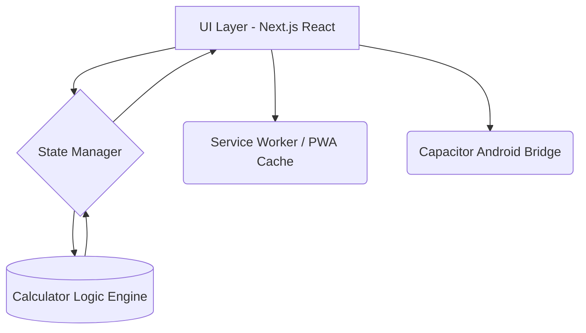

KokoMate: Engineering & Architecture Report

>[!TIP]
> Source Code: [https://github.com/NaveenAkalanka/KokoMate](https://github.com/NaveenAkalanka/KokoMate) | Live Deployment: [Local PWA / Android APK]

1. Executive Summary

"The Elevator Pitch"
KokoMate is a mobile-first progressive web application (PWA) and native Android calculator engineered specifically for Sri Lankan shoppers utilizing the "Koko" Buy-Now-Pay-Later payment gateway. It solves the frustration of hidden fees and unclear payment schedules by instantly generating mathematically exact initial cash obligations, monthly recurrence splits, and total merchant surcharges via a highly responsive and native-feeling user interface.

📥 Downloads: 🤖 Android | 📦 Source

2. Objective & Mission

The Objective
To provide a fast, cross-platform, single-screen utility that accurately calculates and displays exact BNPL installment breakdowns across various merchant surcharge rates and custom down payments. The technical goal is to build an interface that perfectly adapts to fragmented Android screen aspect ratios without wasteful spatial gaps while securely bypassing mobile browser keyboard restrictions.

The Mission
To empower everyday consumers with mathematical transparency during retail checkout experiences.

3. System Architecture



Repository Structure

/src
├── /app          # Next.js Routing & Layout Handlers
├── /components   # Stateful React UI (shadcn)
└── /lib          # Pure Mathematical Algorithms (utils.ts, calculator.ts)


4. The Engineer's Choice (Rationale)

Analyze the most complex module: *Responsive Mobile Keyboard Validation & Screen Fitting*

The Challenge
Android browsers dynamically resize web viewports upon keyboard invocation. Standard HTML5 `<input type="number">` fields rigorously reject partial decimal inputs (`.`), causing input lock-up and layout thrashing across thousands of varying device heights.

The Decision (Rationale)
We implemented semantic `type="text"` fields augmented with `inputMode="decimal"`. This signals the mobile OS to reliably trigger the numeric dial-pad layout, yet fundamentally disables the browser's aggressive internal float validation masking during active keystrokes.

Trade-offs Accepted
- Reassigned validation responsibilities from the native DOM layer to the React Lifecycle (`parseFloat()` fallbacks).
- Negligible CPU calculation overhead during re-renders to ensure absolute input fluidity.
- Utilized `gap-*` layout algorithms over explicit margins to force fluid boundary box elasticity on varying heights.

5. Getting Started

# 1. Clone
```bash
git clone https://github.com/NaveenAkalanka/KokoMate
```

# 2. Install
```bash
npm install
```

# 3. Ignite
```bash
npm run dev
```

6. Evolution & Roadmap

Inception: Late February 2026

The Pivot: Migrated from standard React SPA to Next.js PWA + Capacitor.js to solve Android native distribution and offline edge-caching requirements.

Current: Production-Ready (Android APK / Web)

Future Roadmap (v2.0)
[ ] Intelligent receipt scanning via WebRTC Camera APIs
[ ] Save calculation history into local IndexedDB

7. Technical Specifications

A. Core Mechanics
Engine: Node v20.x, React 19, Next.js 16 (Webpack mode)
Concurrency: Single-threaded pure logical functions.

B. Data & Security
Persistence: Pure stateful runtime (Local memory only). Next-PWA Service Workers cache the static JS bundle for cold-start offline boots.
Auth: Zero-auth, strictly local compute.

C. Visual Evidence
*UI powered by Tailwind CSS v4, dynamic `env(safe-area-inset)` padding for iPhone/Android notches, and dark/light adaptive shading.*

8. Quality Assurance

Test Suite: Vitest configured with JSDOM
Coverage Goal: ~80% mathematical isolation coverage.
Known Limitations: 
1. The app does not ping live Koko API endpoints for real-time merchant rate changes; it relies on hardcoded popular presets (8/10/12) and manual custom inputs.
2. Capacitor WebView bridges are reliant on the end-user's up-to-date system Android System Webview version.

9. How to Contribute

We welcome contributions!
Fork.
Branch.
Commit.
Push.
PR.

Support the Project
If you find this project useful, consider buying me a coffee to keep the servers running and fuel more open-source development!
[Buy Me a Coffee](https://www.buymeacoffee.com/naveenakalanka)

10. Glossary
Term | Definition
PWA | Progressive Web App: Web apps utilizing Service Workers for native-like offline capabilities.
BNPL | Buy Now Pay Later: A short-term financing gateway.
Capacitor | Cross-platform native runtime for building Android/iOS apps with Web Tech.

11. References
- React 19 Features: https://react.dev
- Next.js Documentation: https://nextjs.org

12. License

This project is licensed under the Creative Commons Attribution-NonCommercial-ShareAlike 4.0 International (CC BY-NC-SA 4.0) License.

You are free to:
Share — Copy and redistribute the material in any medium or format.
Adapt — Remix, transform, and build upon the material.

Under the following terms:
Attribution — You must give appropriate credit, provide a link to the license, and indicate if changes were made.
NonCommercial — You may not use the material for commercial purposes.
ShareAlike — If you remix, transform, or build upon the material, you must distribute your contributions under the same license as the original.
